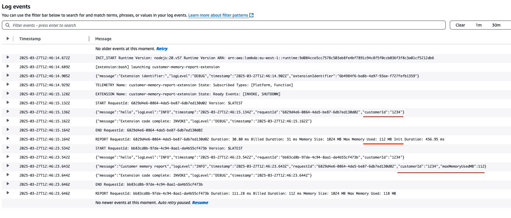

# Customer Memory Report Lambda Extension

This Lambda extension uses the Telemetry API to collect and report memory usage for a specific customer/tenant in a Lambda function. It is designed to be used with JSON structured logs and can be integrated with any Lambda function regardless of the programming language used.

## How to use

1. Clone the repository to your local machine and install the dependencies using `npm ci`.
2. Build the extension using the provided build script via `npm run build`.
3. Copy the ARN of the Lambda layer output from the build step.
4. Add the Lambda layer to your Lambda function using the ARN copied in the previous step.
5. Make sure to emit at least one JSON structured log in your function with this format:

> [!Note]
> The value of `message` should be exactly `customer-memory-report` and the value of `customerId` should be the customer/tenant ID you want to report memory usage for. The `requestId` should come from the Lambda context object.

```json
{
  "customerId": "customer_id",
  "message": "customer-memory-report",
  "requestId": context.awsRequestId,
}
```

Once the extension is added to your Lambda function, it will automatically emit a log after a function invocation with the memory usage for the specified customer/tenant. The log will be in JSON format and will look like this:

```json
{
  "customerId": "customer_id",
  "message": "Customer memory report",
  "requestId": context.awsRequestId,
  "memoryUsage": 1234,
  "timestamp": "2025-10-03T12:00:00Z"
}
```

The `memoryUsage` field will contain the memory usage in MB for the specific customer/tenant reported for that invocation. You can then use this log to monitor the memory usage for each customer/tenant in your Lambda function.

You can also configure the extension to emit the memory usage as a CloudWatch metric. To do this, set the `CUSTOMER_MEMORY_REPORT_METRIC_ENABLED` environment variable to `true`. The extension will then emit a CloudWatch metric with the specified name and namespace.

### Configuration

The extension supports the several environment variables for configuration:

- `CUSTOMER_MEMORY_REPORT_SERVICE_NAME`: The name of the service to report memory usage for. Default is `customer-memory-report`.
- `CUSTOMER_MEMORY_REPORT_LOG_LEVEL`: The log level for the extension. Default is `info`.
- `CUSTOMER_MEMORY_REPORT_METRIC_ENABLED`: Whether to emit the memory usage as a CloudWatch metric. Default is `false`.
- `CUSTOMER_MEMORY_REPORT_METRIC_NAME`: The name of the CloudWatch metric to emit. Default is `CustomerMemoryUsage`.
- `CUSTOMER_MEMORY_REPORT_METRIC_NAMESPACE`: The namespace for the CloudWatch metric. Default is `CustomerMemoryReport`.
- `CUSTOMER_MEMORY_REPORT_METRIC_DIMENSION_NAME`: The dimensions for the CloudWatch metric. Default is `CustomerId`.

## Example



## How it works

The extension uses the [Telemetry API](https://docs.aws.amazon.com/lambda/latest/dg/telemetry-api.html) and subscribes to `platform` and `function` events to collect memory usage for a specific customer/tenant in a Lambda function. It listens for the `customer-memory-report` log message and extracts the `customerId` and `requestId` from the log and stores it in memory.

After the request is completed, Lambda usually sends an event of type `platorm.report` that contains the `requestId` and the memory used by the function during that request (`maxMemoryUsedMb`).

The extension then correlates the `requestId` from the initial log message with the one from the `platform.report` event and emits a log with the memory usage for the specified customer/tenant. The log will contain the `customerId`, `requestId`, `memoryUsage`, and a timestamp.

The extension also emits a CloudWatch metric with the specified name and namespace if the `CUSTOMER_MEMORY_REPORT_METRIC_ENABLED` environment variable is set to `true`. The metric will contain the memory usage for the specified customer/tenant and can be used to monitor the memory usage in CloudWatch.

> [!Note]
> Because of how the Telemetry API works and the fact that it's asynchronous, it's possible that the extension will report the memory usage for a request during the next invoke or during the shutdown of the Lambda function. This is expected behavior and most evident during tests.

## Credits

This extension was inspired by this [blog post](https://danwakeem.medium.com/simplifying-internal-aws-lambda-apis-25a26ab9070e).

## License

See [LICENSE](./LICENSE) for details.
